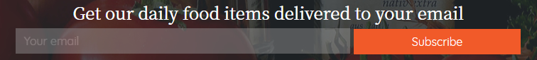

# Maji Restaurant

## Description
This is the landing page for website. It is for a fictional restaurant called Maji. 

## Specifications of how it should work

#### program returns error value entered is not an email address
      Example input: aaa
      Example output: "Please include an @ in the email address"
#### program tells user they have been registered to the mailing list 
      Example input: 'info@javascript.com'
      Example output: "info@javascript.com has been successfully added to our email list. Thank you."

## Getting started
This page gives the user information regarding the restaurant, different menu sections etc. It also contains a subscribe section that allows users to subscribe to a mailing list.

Here is a link to the site: https://mopiata.github.io/maji-restaurant/

### Built With
VSCode for HTML, CSS, JavaScript, JQuery and Bootstrap.

#### Author
Margaret Opiata-Mutungi
Find me on LinkedIn at https://www.linkedin.com/in/margaret-opiata-2700a92b/

#### Contributors
Samuel Ngigi (My instructor)

#### License
This project is licensed under the MIT License.

##### 28th March 2019.
